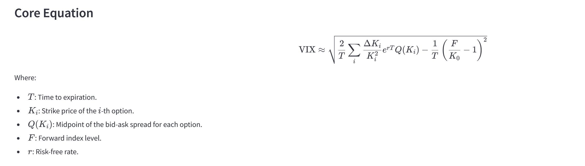

# 📊 Understanding the VIX Index: The Fear Gauge

This interactive Streamlit app helps users understand the **VIX Index**, often referred to as the "fear gauge," and its impact on market sentiment and expected returns. By exploring the relationship between volatility and market performance, users can gain valuable insights into how uncertainty affects financial markets.

The app is designed for educational purposes and provides an engaging way to learn about the VIX through interactive tools, theoretical explanations, practical labs, and beginner-friendly tutorials.

---

## 🌟 Features of the App

1. **Interactive Tool**:
   - Adjust parameters such as the VIX level, market return, and volatility impact factor to observe their effects on adjusted market returns.
   - Visualize the impact of the VIX on market returns using dynamic plots.

2. **Theory Behind VIX**:
   - Learn the mathematical foundation of the VIX, including its core equation and key components like implied volatility, strike prices, and risk-free rates.
   - Understand why the VIX is considered a "fear gauge" and how it reflects market sentiment.

3. **Comprehensive Tutorial**:
   - A step-by-step guide to using the app effectively.
   - Explore real-world examples, such as the impact of high VIX levels during market crashes or low VIX levels in calm markets.

4. **Practical Labs**:
   - Hands-on scenarios to apply your knowledge of the VIX in real-world contexts.
   - Includes labs on market downturns, calm markets, and extreme volatility.

5. **Beginner-Friendly Section**:
   - Simplified explanations of the VIX and its role in finance.
   - Analogies and key takeaways to help beginners grasp complex concepts.

---

## 📚 Key Concepts Covered

1. **What Is the VIX?**
   - The VIX measures market expectations of near-term volatility based on S&P 500 options.
   - High VIX: Indicates fear or uncertainty in the market.
   - Low VIX: Indicates calm and stability.

2. **Core Equation**:
   

   
3. **Key Insights**:
   - Implied volatility reflects market sentiment about future price movements.
   - The VIX spikes during market downturns or crises.
   - Extremely high VIX levels may signal oversold conditions.

---

## 🔬 Practical Labs

Each lab provides a real-world scenario to help you apply the VIX concept:

1. **Lab 1: Market Downturn**
   - Analyze how a spike in the VIX during a market crash impacts returns.

2. **Lab 2: Calm Markets**
   - Explore how low VIX levels boost investor confidence and returns.

3. **Lab 3: Extreme Volatility**
   - Study the role of extreme volatility in market crashes and recovery scenarios.

---

## ⚠️ Disclaimer

This tool is purely for educational purposes. No accuracy guarantees are provided. The author, **Luís Simões da Cunha**, does not engage in financial advising or endorse any specific investment strategies. All information provided is for illustrative and educational purposes only and should not be construed as financial or investment advice.

**Key Points**:
- The VIX is a theoretical framework and may not reflect real-world market conditions.
- Always consult a qualified, accredited financial advisor before making any financial decisions.
- Use of this tool implies acceptance of these terms.

---

## 📜 License

This work is licensed under a [Creative Commons Attribution-NonCommercial 4.0 International License](https://creativecommons.org/licenses/by-nc/4.0/).

You are free to share and adapt this material for non-commercial purposes, provided you give appropriate credit to the author, **Luís Simões da Cunha**, and indicate if changes were made.

By **Luís Simões da Cunha**